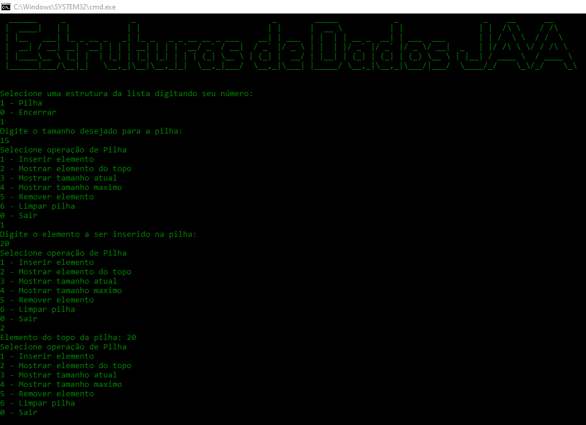

Projeto onde busco implementar *desing patterns* para permitir o acoplamento de implementações de estruturas de dados.

Baixe o arquivo [Estruturas de Dados JAVA.exe](Estruturas%20de%20Dados/Estruturas%20de%20Dados%20JAVA.exe) para rodar o programa.

>Pré-requisito:
OpenJDK Runtime Environment (build 12.0.2+10) Class file version up to 52.0.

